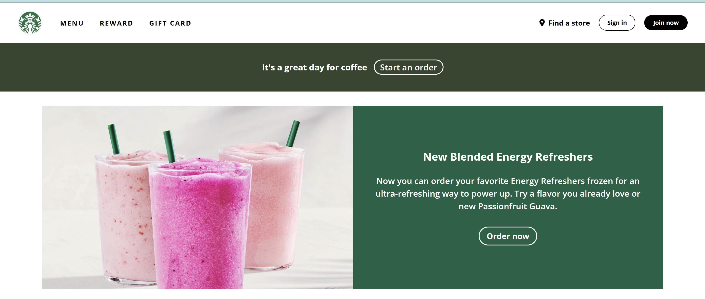
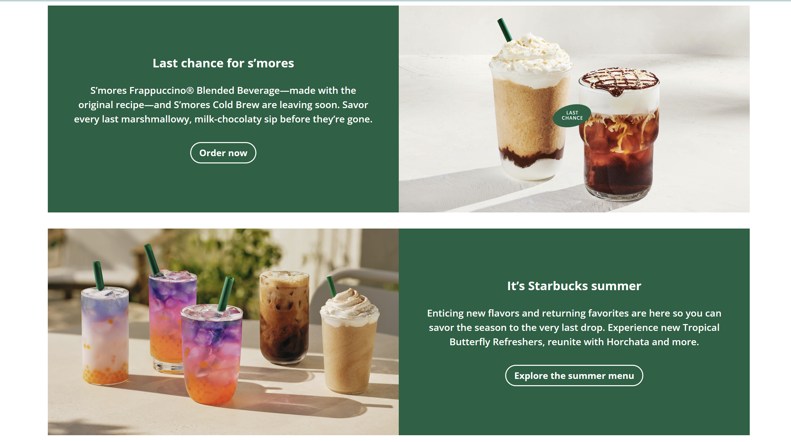
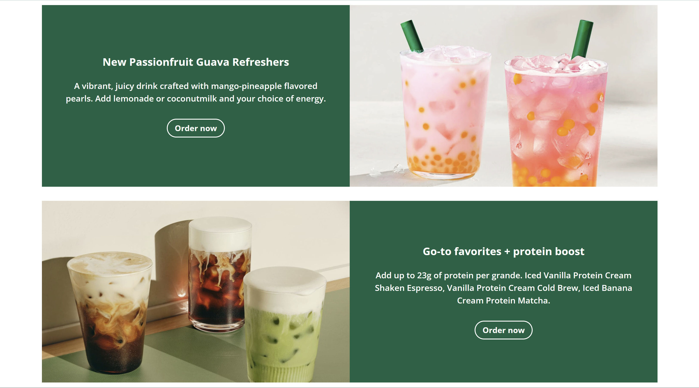
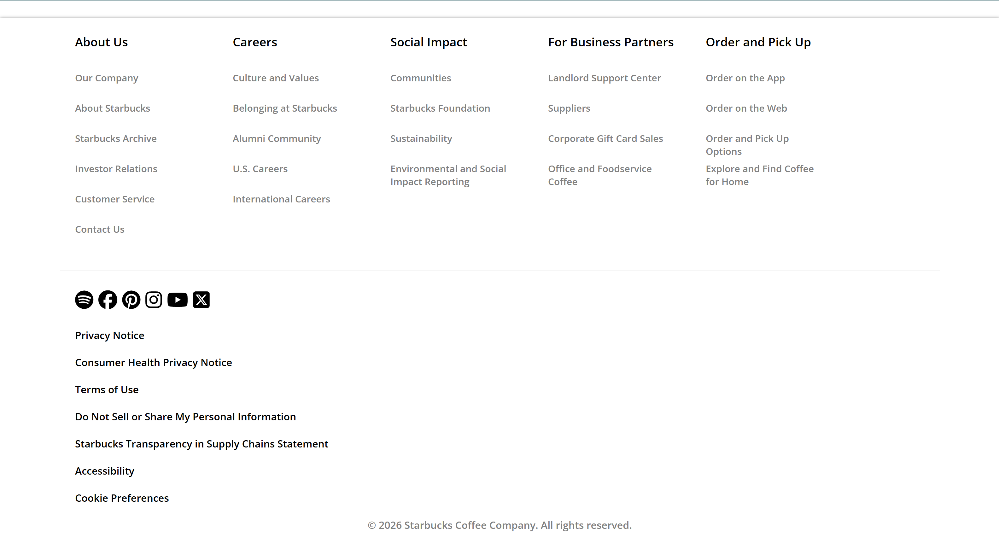

# Starbucks Clone

A responsive Starbucks landing page clone built using **HTML** and **CSS**. This project recreates the look and feel of the Starbucks homepage and was created to practice front-end web development skills.

---

## Features

- Responsive design
- Modern and clean UI
- Navigation bar
- Hero section
- Product showcase
- Footer section
- Beginner-friendly code structure

---

## Built With

- HTML5
- CSS3

---

## 📂 Project Structure

```
STARBUCKS-CLONE/
│── clone-screenshots/
│── img/
│   ├── logo.png
│── clone-video.mp4
│── index.html
│── style.css
│── README.md
```

---

## Screenshots






---

## 🎥 Demo Video


Example:


---

##  Purpose

This project was built to improve my HTML and CSS skills by recreating a modern website layout.

---

## Author

**Kalp Prajapati**

- GitHub: https://github.com/kalpprajapati

---

## Support

If you like this project, please consider giving it a ⭐ on GitHub.
